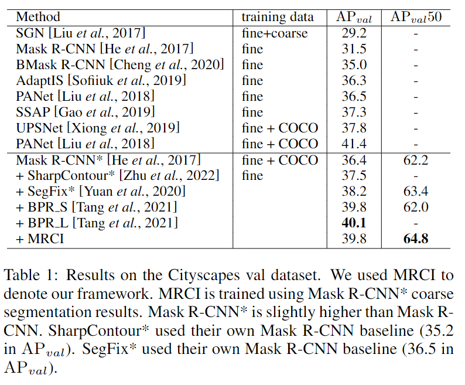
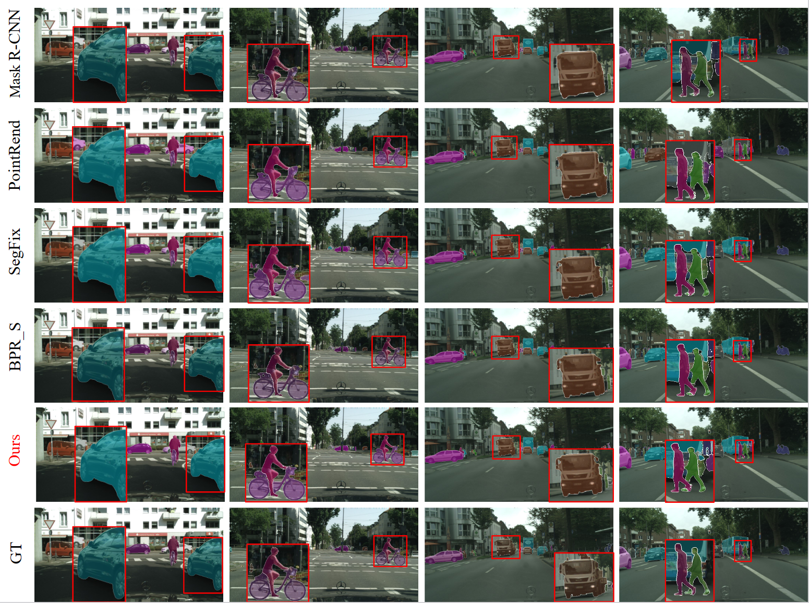

# MRCI: Multi-Range Context Interaction Network for Boundary Refinement

Training and inference code will be open source soon.

> [**MRCI: Multi-Range Context Interaction Network for Boundary Refinement**](https://arxiv.org/abs/*******)
>
> *IJCAI 2023 deliveryI*

## Introduction

The quality of current instance segmentation has been greatly improved, but the boundary accuracy is still unsatisfactory. In practice, the general,efficient and accurate post-processing refinement schemes are required. Most of existing boundary refinement approaches ignore different range contexts and global knowledge, causing low adaptability for various coarse segmentation errors. To address these issues, we propose a novel multi-range context interaction framework, MRCI, which aims to refine the boundaries of predicted masks with sufficient context knowledge and lower computational costs. We design a multi-range context-aware approach to extract richer local features and inject global knowledge prompt to guide boundary refinement. The proposed approach achieves impressive results on the popular Cityscapes dataset,obtaining tier-one AP value and highest AP50 value among the current state-of-the-art post-processing models with only 4M parameters.

For more details, please refer to our [paper]().

## Cityscapes Results

## Qualitative Results

## Usage

We provide the results generated by our model on the test and validation sets. You can download [MRCI_MaskRCNN_AP398.zip](https://) or [MRCI_Pointrend.zip]() and [MRCI_Segfix.zip]() to view and evaluate our results by [cityscapesScripts](https://github.com/mcordts/cityscapesScripts).

## Citation

To be added...
